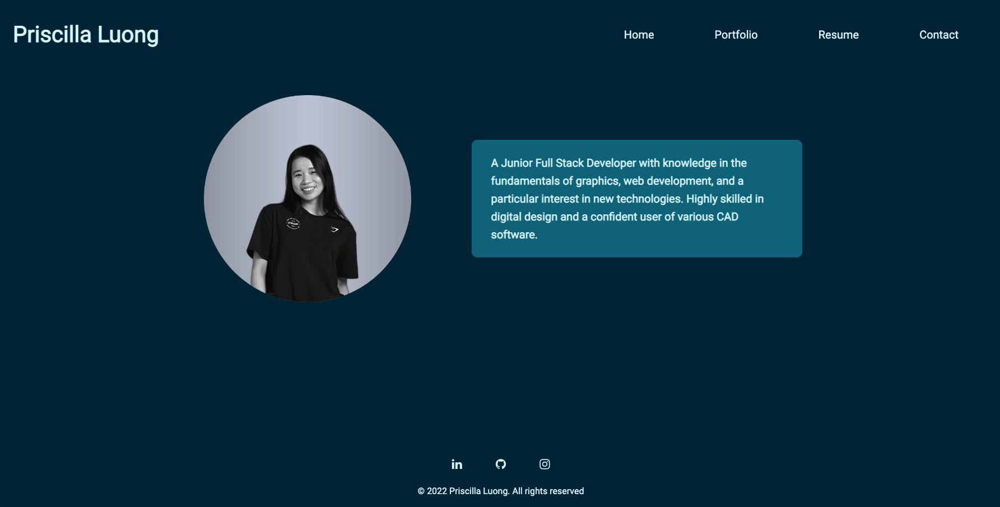
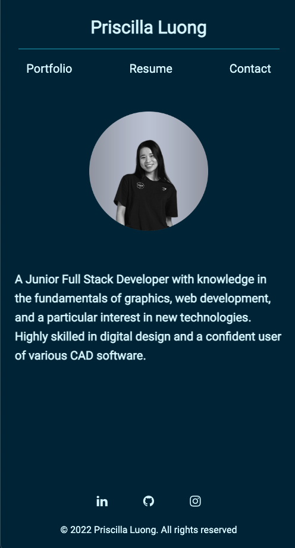
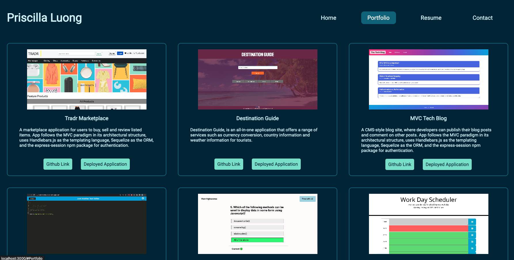
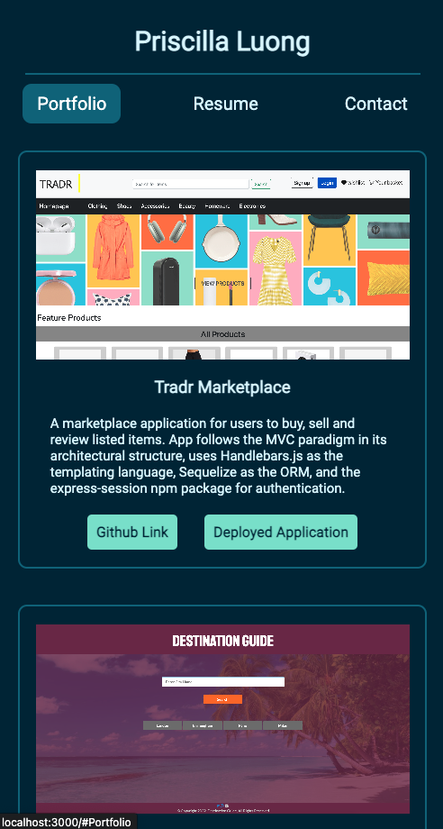
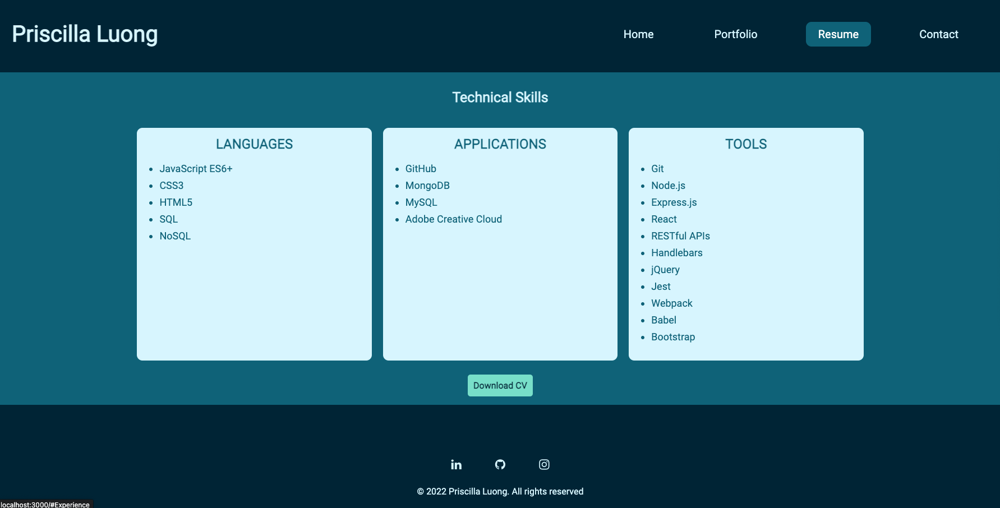
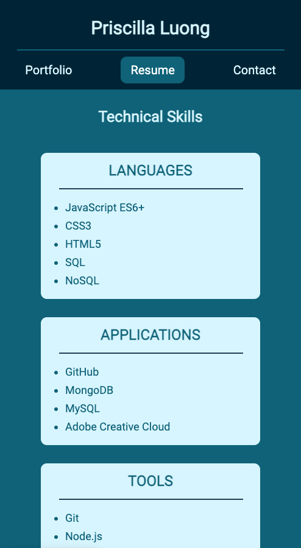
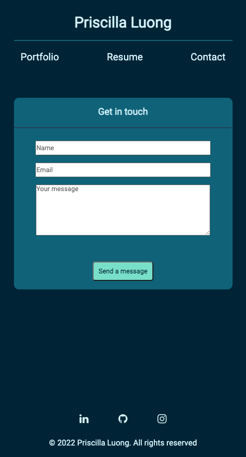

# my-react-portfolio

       


A React portfolio to share my projects / existing work. This application has been deployed to GitHub Pages. See [link](#link-to-deployed-application) below.

## User Story

```md
AS AN employer looking for candidates with experience building single-page applications
I WANT to view a potential employee's deployed React portfolio of work samples
SO THAT I can assess whether they're a good candidate for an open position
```

## Acceptance Criteria

```md
GIVEN a single-page application portfolio for a web developer
WHEN I load the portfolio
THEN I am presented with a page containing a header, a section for content, and a footer
WHEN I view the header
THEN I am presented with the developer's name and navigation with titles corresponding to different sections of the portfolio
WHEN I view the navigation titles
THEN I am presented with the titles About Me, Portfolio, Contact, and Resume, and the title corresponding to the current section is highlighted
WHEN I click on a navigation title
THEN I am presented with the corresponding section below the navigation without the page reloading and that title is highlighted
WHEN I load the portfolio the first time
THEN the About Me title and section are selected by default
WHEN I am presented with the About Me section
THEN I see a recent photo or avatar of the developer and a short bio about them
WHEN I am presented with the Portfolio section
THEN I see titled images of six of the developer’s applications with links to both the deployed applications and the corresponding GitHub repositories
WHEN I am presented with the Contact section
THEN I see a contact form with fields for a name, an email address, and a message
WHEN I move my cursor out of one of the form fields without entering text
THEN I receive a notification that this field is required
WHEN I enter text into the email address field
THEN I receive a notification if I have entered an invalid email address
WHEN I am presented with the Resume section
THEN I see a link to a downloadable resume and a list of the developer’s proficiencies
WHEN I view the footer
THEN I am presented with text or icon links to the developer’s GitHub and LinkedIn profiles, and their profile on a third platform (Stack Overflow, Twitter)
```

# Installation:

To install dependancies:
```
npm i
```
To run application:
```
npm start
```

# Screenshots of Deployed Application:

Desktop / Larger Screens - Homepage:



Mobile View - Homepage:



Desktop / Larger Screens - Portfolio Page:



Mobile View - Portfolio Page:



Desktop / Larger Screens - Resume Page:



Mobile View - Resume Page:



Desktop / Larger Screens - Contact Page:


Mobile View - Contact Page:



# License:

[](https://opensource.org/licenses/Apache-2.0)

# Link to Deployed Application:

[Click here](https://priscillaluong.github.io/my-react-portfolio/)

### Final note:

_Any feedback to improve code or implement best practice would be appreciated_ 😊